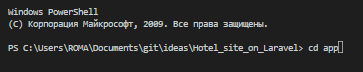
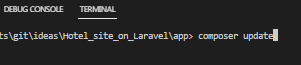
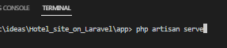

## Сайт для бронирования номеров в отеле

### Приветствую Вас на моем репозитории!

Данный проект находится на версии демо, и тестируется в данный момент.

Для работы с данным проектом необходимо:

1. С начала Вам неробходимо открыть командную строку на папке репозитория после клонирования и перейти на папку app.

2. Далее Вам необходимо выполнить команду `composer update` для обновления данных.

3. Затем необходимо выполнить команду `php artisan serve` для запуска сервера.

4. Далее нужно перейти по адресу `http://localhost:8000/`.

## Все! Можете рассмотреть демо проект! Спасибо за внимание!
